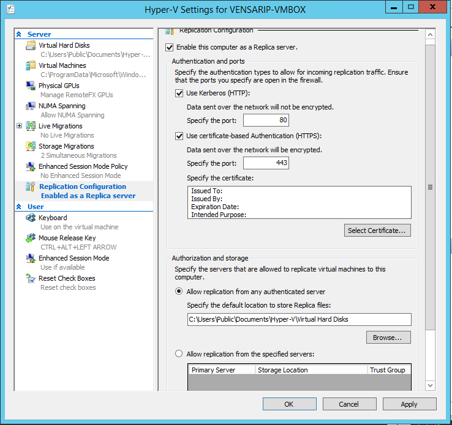
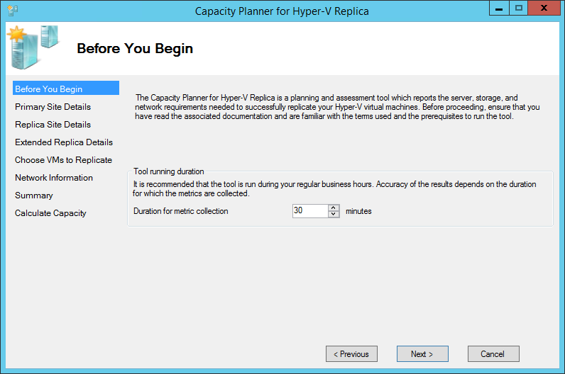
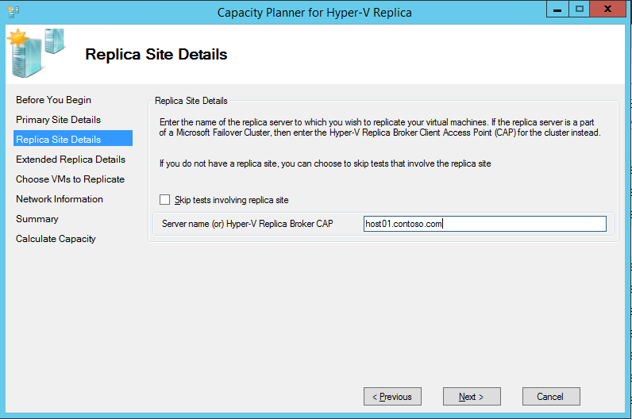
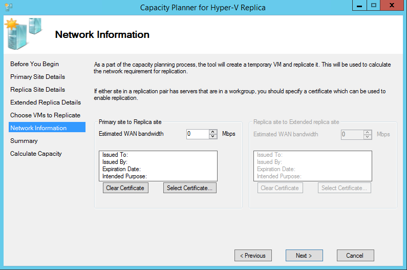
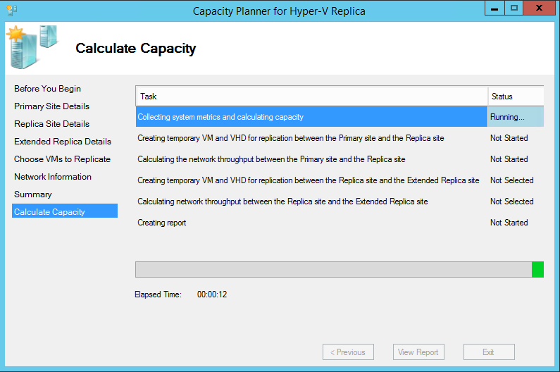

<properties 
	pageTitle="Azure Site Recovery: Capacity planning with Hyper-V Replication" 
	description="Azure Site Recovery: Use the Hyper-V Capacity planner tool to estimate the bandwidth required, impact on CPU, Memory, Storage IOPS." 
	editor="jimbe" 
	manager="jwhit" 
	authors="vensarip"/>

<tags 
	ms.service="site-recovery" 
	ms.workload="backup-recovery" 
	ms.tgt_pltfrm="na" 
	ms.devlang="na" 
	ms.topic="article" 
	ms.date="20/2/2015" 
	ms.author="vensarip"/>

#Capacity planning for Azure Site Recovery: Using the Hyper-V Replica capacity planner tool 

<h2>Introduction</h2>

This article contains step by step instructions on using Capacity
planner for Azure Site Recovery (ASR) - Hyper-V Replica. The Capacity Planner for ASR -
Hyper-V Replica guides an IT administrator in designing the server, storage and
network infrastructure which is required to successfully deploy Hyper-V
Replica and in validating network connectivity between two sites.

<h2> System requirements </h2>

  
  Operating System:	Windows Server® 2012 (or) Windows Server® 2012 R2

  Memory:	20 MB (minimum)

  CPU:	5% overhead (minimum)

  Disk space:	5 MB (minimum)

<h2>Tutorial steps</h2>

<UL>
<LI><a href="#primary">Step 1: Primary site preparation</a></LI>
<LI><a href="#recovery">Step 2: Recovery site preparation</a> – If your recovery site is on-premises </LI>
<LI><a href="#tool">Step 3: Run the capacity planner tool</a></LI>
<LI><a href="#interpret">Step 4: Interpret the results</a></LI>
</UL>

<h2>Step 1: Primary site preparation</h2>

1.  Make a list of all Hyper-V virtual machines that will need to be
    enabled for replication and the corresponding primary Hyper-V
    hosts/clusters.

2.  Group primary Hyper-V hosts and clusters into one of the following

    a.  Windows Server® 2012 standalone servers

    b.  Windows Server® 2012 clusters

    c.  Windows Server® 2012 R2 standalone servers

    d.  Windows Server® 2012 R2 clusters

3.  You would need to run the capacity planner tool once per standalone
    server Group and once for each cluster.
4.  Enable Remote access to WMI on all primary hosts and clusters.
    Ensure that the right set of firewall rules (**netsh firewall set
    service RemoteAdmin enable**) and user permissions are set.

5.  Enable Performance monitoring on Primary hosts.

    -   Open the **Windows Firewall** with the **Advanced Security**
        snap-in and enable the following inbound rules:

        -   COM+ Network Access (DCOM-In)

        -   All rules in the Remote Event Log Management group

<h2>Step 2: Recovery site preparation</h2> 

1. Identify the authentication method

    a.  Kerberos: To be used when both the primary and recovery hyper-v
        hosts are in the same domain or mutually trusted domains

    b.  Certificate: To be used when primary and recovery hyper-v hosts
        are in different domains. Certificates can be created using makecert and [this
        post](http://blogs.technet.com/b/virtualization/archive/2013/04/13/hyper-v-replica-certificate-based-authentication-makecert.aspx)
        captures the steps required to deploy certificates using this
        technique.
      

2. Identify <b>a single</b> Recovery Hyper-V host/cluster from the
    recovery site.

    a.  This recovery host/cluster will be used to replicate a dummy
        virtual machine and to estimate the available bandwidth between
        primary and secondary sites.

    b.  **Recommended:** Use a single Recovery Hyper-V Host for running
        the tests.

<h3>Prepare a single Recovery Hyper-V Host</h3>

1.  In Hyper-V Manager, click **Hyper-V Settings** in the
        **Actions** pane.

2.  In the **Hyper-V Settings** dialog, click **Replication
        Configuration**.

3.  In the Details pane, select **Enable this computer as a Replica
        server**.

4.  In the **Authentication and ports** section, select the
        authentication method you decided on. For either authentication
        method, specify the port to be used (the default ports are 80
        for Kerberos over HTTP and 443 for certificate-based
        authentication over HTTPS).

5.  If you are using certificate-based authentication, click
        **Select Certificate** and provide the certificate information.

6.  In the **Authorization and storage** section, use the radio
        buttons to specify whether to allow **any** authenticated
        (primary) server to send replication data to this Replica server
        or to limit acceptance to data from specific primary servers.

7.  Click **OK** or **Apply** when you are finished.

       

8.  Validate that the https listener is running by executing
        “**netsh http show servicestate**”.

9.  Open firewall ports

        Port 443 (certificate based auth):
            Enable-Netfirewallrule -displayname "Hyper-V Replica HTTPS Listener (TCP-In)"

        Port 80 (Kerberos): 
			Enable-Netfirewallrule -displayname "Hyper-V Replica HTTP Listener (TCP-In)"

<h3>Prepare a Recovery Hyper-V Cluster</h3>

1.  Configure Hyper-V Replica broker
		
	a. In Server Manager, open **Failover Cluster Manager**.</li>

	b. In the left pane, connect to the cluster, and while the cluster name is highlighted, click **Configure Role** in the Actions pane. The **High Availability wizard** opens</li>

    c. In the **Select Role** screen, select **Hyper-V Replica
            Broker**.</li>

    d. Complete the wizard, providing a **NetBIOS name** and **IP
            address** to be used as the connection point to the cluster
            (called a “client access point”). The **Hyper-V Replica
            Broker** is configured, resulting in a client access point
            name. Make a note of the **client access point name** for
            configuring Replica later on.

    e.  Verify that the Hyper-V Replica Broker role comes online
            successfully and can fail over between all nodes of the
            cluster. To do this, right-click the role, point to
            **Move**, and then click **Select Node**. Then, select a
            node, and then click OK.

    f.  If you use certificate-based authentication, ensure that each
        cluster node and the Hyper-V Replica Broker’s client access
        point all have the certificate installed.

2.  Configure Replica settings

    a.  In Server Manager, open **Failover Cluster Manager**.

    b. In the left pane, connect to the cluster, and while the
            cluster name is highlighted, click **Roles** in the
            **Navigate** category of the **Details** pane

    c. Right-click the role and choose **Replication Settings**.

    d. In the Details pane, select **Enable this cluster as a
            Replica server**.

    e.  In the **Authentication and ports** section, select the
            authentication method you decided on. For either
            authentication method, specify the port to be used (the
            default ports are 80 for Kerberos over HTTP and 443 for
            certificate-based authentication over HTTPS).

    f. If you are using certificate-based authentication, click
            **Select Certificate** and provide the request certificate
            information.

    g. In the **Authorization and storage** section, use the radio
            buttons to specify whether to allow **any** authenticated
            (primary) server to send replication data to this Replica
            server or to limit acceptance to data from specific primary
            servers. You can use wildcard characters to limit acceptance
            to servers from a particular domain without having to
            specify them all individually (for example, \*.contoso.com).

    h.  Open firewall ports on all Recovery Hyper-V Hosts

        Port 443 (Certificate auth): 
			Get-ClusterNode | ForEach-Object {Invoke-command -computername \$\_.name -scriptblock {Enable-Netfirewallrule -displayname "Hyper-V Replica HTTPS Listener (TCP-In)"}}

        Port 80 (Kerberos auth): 
			Get-ClusterNode | ForEach-Object {Invoke-command -computername \$\_.name -scriptblock {Enable-Netfirewallrule -displayname "Hyper-V Replica HTTP Listener (TCP-In)"}}

<h2>Step 3: Run the tool</h2>
--------------------

1.  Download and run the [Capacity planner
    tool](http://go.microsoft.com/?linkid=9876170). It is recommended
    that the tool is run from one of the primary servers (or one of the
    nodes from the primary cluster). Right-click on the exe file, and
    choose the **Run as administrator** option.

2.  Accept the **Terms of License** and click on **Next**

3.  Select a **Duration for metric collection**.

    It is highly recommended that the tool is run during *production
    hours* which ensures that the most representative data is collected.
    The suggested duration for metric collection is 30 minutes. If
    you’re only trying to validate network connectivity, you can choose
    1 min.

    

4.  Specify the **Primary site details** in this screen and click
    ‘Next’:

    For a standalone host, enter the server name or FQDN.

    If your Primary host is part of a cluster, you can either enter the
    FQDN of:

    a.  The Hyper-V Replica Broker Client Access Point (CAP)

    b.  The cluster name

    c.  Any node of the cluster

      

5.  Enter **Replica site details** (On-premises site to On-premises
    site replication only)

    If you’re looking to enable replication to Azure, you should skip
    the tests involving the replica site.

    Specify the **Replica site** details in this screen and click ‘Next’:

	i.  For a standalone host, enter the server name or FQDN.

	ii. If your Replica host is part of a cluster, enter the FQDN of the
    Hyper-V Replica Broker Client Access Point (CAP).

	   

6.  Skip tests involving **Extended Replica site**. This is not
    supported by Azure Site Recovery.

7.  **Select the VM’s** to profile: The tool connects to the cluster or
    standalone servers specified in the ‘Primary Site Details’
    and enumerates the virtual machines which are running. Select the virtual machines and virtual disks for which the metrics need to be collected.

    The following virtual machines will not be enumerated or shown:

    a.  Virtual machines that have already been enabled for replication.

    b.  Virtual machines that are not running.

8.  Enter **Network information** (On-premises Site to On-premises Site
    replication only)

    Specify the Network Information requested in this screen and click
    ‘Next’:

    a.  Estimated WAN bandwidth

    b.  Certificate to be used for authentication (optional): If
        certificate based authentication is being used in your Hyper-V
        Replica environment, you should provide the required
        certificates in this page. 

    

4.  Click “Next” on the next set of screens to start the tool’s
    execution.

    

5.  Once the tool has completed, you will be able to click on ‘View
    Report’ to go over the output.

    Report location:
    *"%systemdrive%\\Users\\Public\\Documents\\CapacityPlanner"*

    Logs location:
    *"%systemdrive%\\Users\\Public\\Documents\\CapacityPlanner"*

<h2>Step 4: Interpret the results</h2>
=============================

You can ignore metrics which are not listed below. They are not relevant
to your scenario.

On-premises site to On-premises site replication
------------------------------------------------

-   Impact of replication on Primary host’s Compute, Memory

-   Impact of replication on Primary, Recovery host’s Storage disk
    space, IOPS

-   Total bandwidth required for delta replication (Mbps)

-   Observed network bandwidth between the primary host and the recovery
    host (Mbps)

-   Suggestion for the ideal number of active parallel transfers between
    the two hosts/clusters

On-premises site to Azure replication
-------------------------------------

-   Impact of replication on Primary host’s Compute, Memory

-   Impact of replication on Primary host’s Storage disk space, IOPS

-   Total bandwidth required for delta replication (Mbps)

More detailed guidance on using the tool and interpreting the results
can be found [here](http://go.microsoft.com/?linkid=9876170).
